[](https://matlab.mathworks.com/open/github/v1?repo=KantikaAscendas/ForecastingThailand-GDP-Analysis&file=THGDPAnalysis_Main.mlx)
# Time\-Series Forecasting with MATLAB: Thailand GDP Analysis

 **Objective:** Demonstrate MATLAB's Econometric Modeler for economic time\-series analysis using Thailand GDP data


**Key Features:** 


\- Data Import and Preparation 


\- Exploratory Data Analysis 


\- Stationarity Testing (Augmented Dickey\-Fuller) 


\- ACF/PACF Analysis 


\- ARIMA Model Specification & Fitting 


\- Forecasting with Confidence Intervals

```matlab
clear; clc; close all;
```
<a id="TMP_9cde"></a>

# Low\-code programming with Econometric Modeler

Data: GDP (current US\$) in billions \- Annual 2000\-2023 Source: World Bank DataBank

<a id="TMP_565a"></a>

# 1.Data Access

import Thailand\_GDP\_Data.csv

```matlab
% import using live task\
```

```matlab
% Import data from text file
GDPDataTT = readtable("D:\Live Demo Matlab\7.DemoKantika2025\Finance\Demo BOT\ForecastingThailand GDP Analysis\Thailand_GDP_Data.csv");

% Display results
GDPDataTT
```


| |Year|GDP|
|:--:|:--:|:--:|
|1|2000|122.6800|
|2|2001|126.7500|
|3|2002|133.8200|
|4|2003|143.5100|
|5|2004|162.2400|
|6|2005|180.6800|
|7|2006|206.5900|
|8|2007|235.1100|
|9|2008|259.4200|
|10|2009|282.7200|
|11|2010|308.8200|
|12|2011|334.1500|
|13|2012|365.9700|
|14|2013|398.5000|
|15|2014|417.5900|
|16|2015|455.2100|
|17|2016|455.2200|
|18|2017|407.0400|
|19|2018|429.3200|
|20|2019|476.7100|
|21|2020|495.5500|
|22|2021|505.9800|
|23|2022|514.2300|
|24|2023|528.1700|


# 2. Create time table
```matlab
dates = datetime(Thailand_GDP_Data.Year, 1, 1);
TT = timetable(dates, Thailand_GDP_Data.GDP, 'VariableNames', {'GDP_Billions'});

fprintf('\nFirst 3 Observations:\n');
```

```matlabTextOutput
First 3 Observations:
```

```matlab
disp(head(TT, 3));
```

```matlabTextOutput
       dates       GDP_Billions
    ___________    ____________

    01-Jan-2000       122.68   
    01-Jan-2001       126.75   
    01-Jan-2002       133.82   
```

```matlab
fprintf('\nLast 3 Observations:\n');
```

```matlabTextOutput
Last 3 Observations:
```

```matlab
disp(tail(TT, 3));
```

```matlabTextOutput
       dates       GDP_Billions
    ___________    ____________

    01-Jan-2021       505.98   
    01-Jan-2022       514.23   
    01-Jan-2023       528.17   
```

# 3.Preprocessing Data
<a id="TMP_37a5"></a>

## Log Transformation
```matlab
%preprocessing data live task
GDP_BillionsLog = log(TT.GDP_Billions);
```
## Detrend Data
```matlab
% Remove trend from input data
detrendedData = detrend(GDP_BillionsLog);

% Display results
figure
plot(GDP_BillionsLog,SeriesIndex=6,DisplayName="Input data")
hold on
plot(detrendedData,SeriesIndex=1,LineWidth=1.5,DisplayName="Detrended data")
plot(GDP_BillionsLog-detrendedData,SeriesIndex=2,LineWidth=1, ...
    DisplayName="Trend")
hold off
legend
```

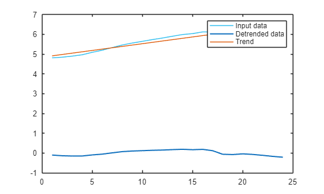

Input Data : GDP(Log transform) ขึ้นเรื่อย (มี Trend ชัด)   → ไม่ Stationary → ใช้ ARIMA ไม่ได้


Trend : เส้นแนวโน้มเส้นตรง (Linear) บอกว่า "GDP ขึ้นประมาณเท่าไหร่ต่อปี"


Detrended Data : ข้อมูลที่หลัง Trend ออกแล้ว แกว่งรอบ 0 (Up\-Down สม่ำเสมอ) → Stationary → ใช้ ARIMA ได้


ตอนนี้เรามี Detrended Data แล้ว


 ขั้นตอนถัดไป: 


1. ใช้ Detrended Data ทำ ARIMA


2. ทดสอบ Stationarity (ADF Test) ใหม่    → ควรได้ p\-value < 0.05 


3. ดู ACF/PACF 


4. สร้างโมเดล ARIMA 5. พยากรณ์

# 4.Perform Data Analysis and Modelling
```matlab
econometricModeler
```
<a id="TMP_5e9f"></a>

### **Import Data to the modeller**

Import Data to Econometric Modeler


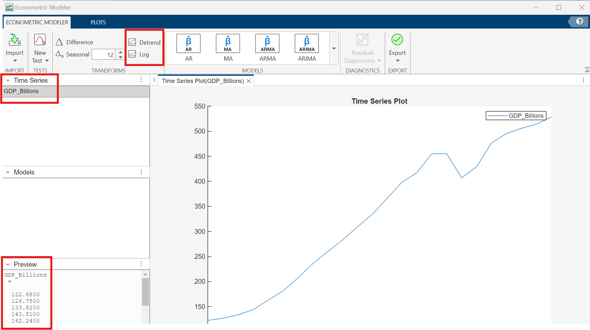

<a id="TMP_25a2"></a>

### Data Transformation

**Step 1. Check for Stationarity.** If non\-stationary, then apply differencing/seasonal differencing *(d)*. Finally, you can test again for Stationarity.


The stationarity test results suggest whether you should transform a series to stabilize it, and which transformation is appropriate.


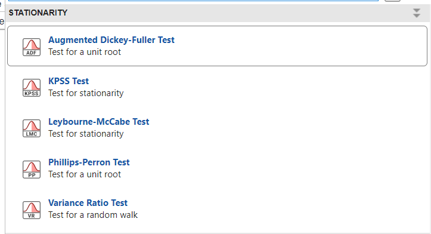


**Setting this value in the APP**

|||
| :-- | :-- |
| **Number of Lags:**  | 0 or Auto   |
|  **Significance Level:**   | 0.05   |
|  **Model:**   | Trend Stationary   |
| **Test Statistic:**  | Standard t statistic   |


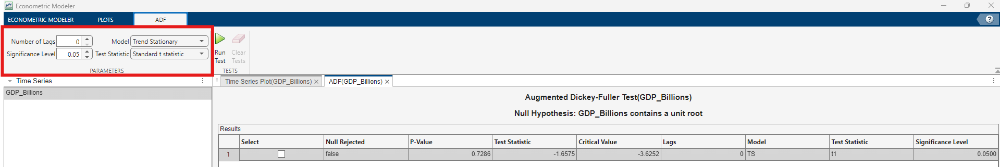


\*\*P\-Value (0.7286) > 0.05  FAIL TO REJECT H0   = ข้อมูลยังเป็น NON\-STATIONARY   = ต้องแปลงข้อมูล


 p\-value < 0.05:    → "Stationary"  → Go to Next Step 2


For example, the **Augmented Dickey\-Fuller Test**  allows you to test stationarity with the following Hypotheses.


**H0:** Series is non\-stationary.


**H1:** Series is stationary.


You can test (with various test statistic) on the following parameters (number of lags, model type). Apply differencing or detrending as needed.


Model Type includes:


&nbsp;&nbsp;&nbsp;&nbsp; Autoregressive (AR) \- test on data if stationary around 0 mean.


&nbsp;&nbsp;&nbsp;&nbsp; AR with drift \- test on data if stationary around nonzero mean.


&nbsp;&nbsp;&nbsp;&nbsp; Trend Stationary (TS) \- test on data if stationary around a linear trend.


**Step 1.1 Difference**


ทำการ **Difference 1 ครั้ง** แล้วทดสอบด้วย **Augmented Dickey\-Fuller (ADF) Test**


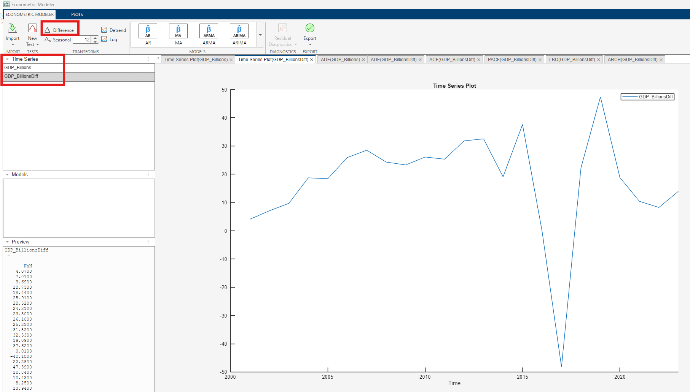


ค่า  **p\-value = 0.0129 < 0.05** สรุป: ข้อมูล `GDP_BillionsDiff` ตอนนี้เป็น **Stationary แล้ว**


หมายความว่าไม่มี “trend” เหลือในข้อมูล — พร้อมนำไปสร้างโมเดล ARIMA


**Step 2 ACF/PACF plots for model identification**


Plot ACF and PACF to find the  *p* and  *q* order of the ARMA model. You can apply differencing/seasonal differencing as needed.


ตอนนี้เราต้องการหาค่าพารามิเตอร์ 2 ตัวคือ

-  **p** = จำนวนของ AR terms (จาก PACF) 
-  **q** = จำนวนของ MA terms (จาก ACF) 

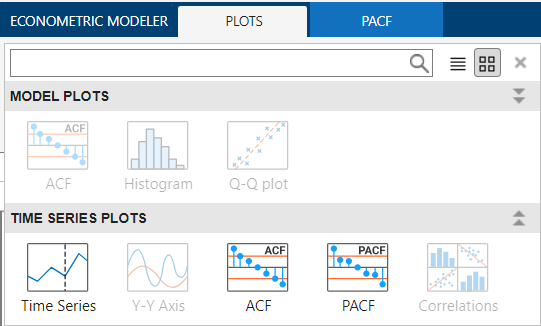

||||
| :-- | :-- | :-- |
| Model  | ACF  | PACF   |
| AR  | tail\-off  | cut\-off   |
| MA  | cut\-off  | tail\-off   |
| ARMA  | tail\-off  | tail\-off   |


Plot ACF


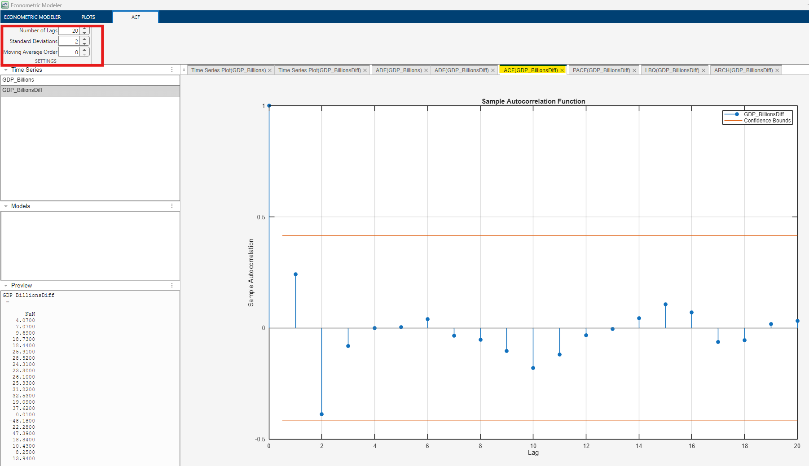

-  ไม่มีค่าใดของ lag ที่สูงเกิน “เส้นส้ม” (Confidence Bound)→ หมายความว่า **ไม่มี autocorrelation เหลืออยู่ในข้อมูล** 

สรุปว่า “ส่วนของ MA (Moving Average)” น่าจะไม่จำเป็นมาก ดังนั้น **q ≈ 0**


**\*\*จุดที่ Lag = 0** มีค่า correlation = 1 เสมอ


เพราะมันคือการเทียบตัวเองกับตัวเอง (ค่าความสัมพันธ์ 100%) ซึ่ง **เป็นเรื่องปกติ ไม่ต้องตีความ**


เราจะเริ่มวิเคราะห์ตั้งแต่ **Lag 1 ขึ้นไป**


Plot PACF


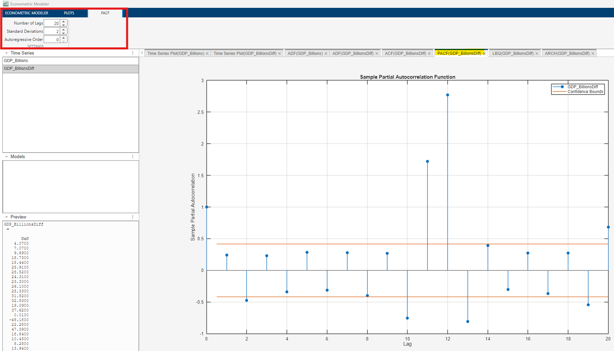

-  จุด spike ที่ชัดเจน **อยู่ที่ Lag 10, 11, 12, 13** 
-  ที่เหลือก่อนหน้า (Lag 1–9) อยู่ในช่วงเส้นส้ม (ไม่ significant) 

“ข้อมูลในปัจจุบันของ GDP มีความสัมพันธ์โดยตรงกับค่าในอดีตช่วงประมาณ 10–13 ช่วงเวลาก่อนหน้า”

||||
| :-- | :-- | :-- |
| PACF มี spike ที่ Lag 10–13  | ข้อมูลยังมี pattern ซ้ำเป็นรอบ (cycle) ทุกประมาณ 10 ช่วงเวลา  | มี AR effect ระยะยาว   |
| PACF ตัดขาดหลัง Lag 13  | ความสัมพันธ์หายไปหลัง 13 ช่วงเวลา  | โมเดลควรใช้ p ≈ 10–13   |
| ACF ไม่มี spike  | ไม่มี MA component  | q = 0   |


ดังนั้น ลองสร้างโมเดล ARIMA ที่มี AR term อยู่ในช่วงนี้ เช่น **ARIMA(10,1,0)** หรือ  **ARIMA(12,1,0)** แล้วเปรียบเทียบค่า AIC/BIC เพื่อเลือกโมเดลที่ดีที่สุด


 **Step 3** ARIMA parameter estimation (p,d,q)


Based on your ACF and PACF plots, you are ready to create your model. Select the original Time Series and select SARIMA as your model.

<a id="TMP_0aa1"></a>

### Selecting your Model

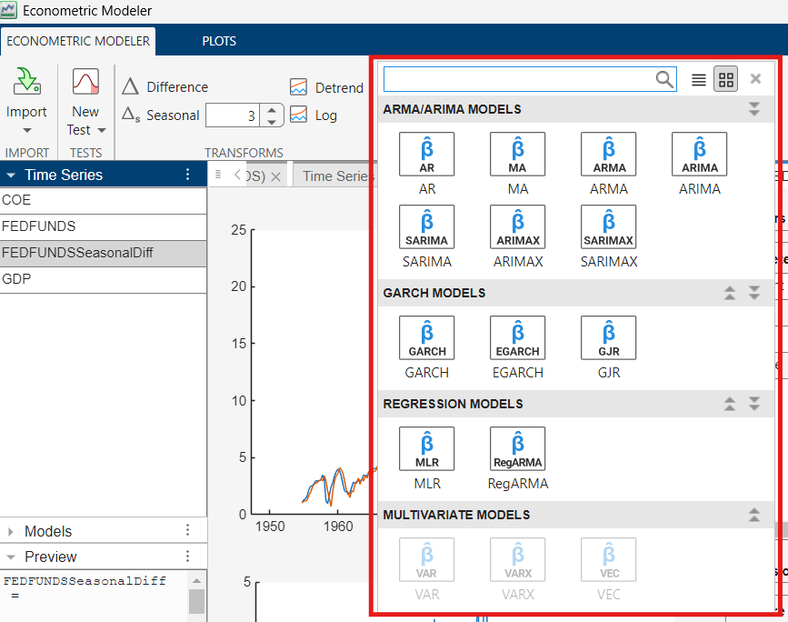


ARIMA *(Autoregressive Integrated Moving Average)* \- Model the mean (or level) of a time series by capturing autocorrelation, trends, and seasonality. It assumes errors have constant variance.


GARCH  *(Generalized Autoregressive Conditional Hetesocedasticity)* \-  Models the *variance* (volatility) of a time series by capturing periods of high and low fluctuations.


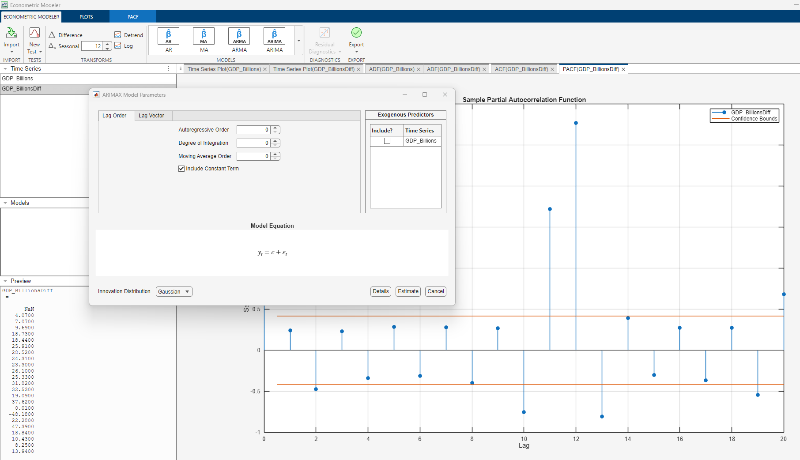


**Analysis Model**


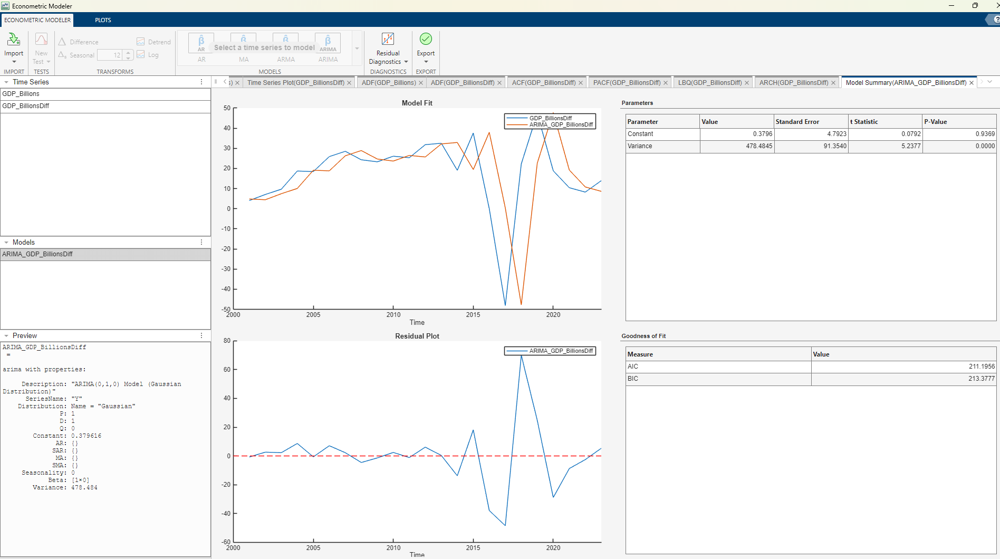


**ประเมินโมเดล ARIMA(0,1,0)** สำหรับข้อมูล `GDP_BillionsDiff` ซึ่งถือเป็น “โมเดลง่ายสุด” หรือที่เรียกว่า  **Random Walk Model** “ค่าปัจจุบันของ GDP จะเท่ากับค่าก่อนหน้า + ค่าคงที่เล็กน้อย + ความผันผวนแบบสุ่ม”

| **Parameter**  | **Value**  | **ความหมาย**   |
| :-- | :-- | :-- |
| **Constant (c)**  | 0.3796  | ค่า drift เฉลี่ยของการเปลี่ยนแปลง GDP ต่อช่วงเวลา   |
| **Variance**  | 478.4845  | ความผันผวนของค่าคาดเคลื่อน (noise)   |
| **p\-value (constant)**  | 0.9369 (> 0.05)  | ค่าคงที่นี้ “ไม่ significant” แสดงว่าแนวโน้มเฉลี่ย ≈ 0   |
| **AIC / BIC**  | 211.2 / 213.4  | ใช้เปรียบเทียบโมเดลอื่น (ยิ่งต่ำยิ่งดี)   |


**สรุปทางสถิติ:**


โมเดลนี้ไม่มีแนวโน้มชัดเจน (drift ≈ 0)


→ ข้อมูล GDP\_diff มีลักษณะเป็น **random fluctuation** หลังการ difference


ลอง “ปรับ ARIMA ด้วย Lag Vector” ARIMA(10,1,0) 

-  **ARIMA(10,1,0)** 
-  **Lag Vector:** \[10\] → ใช้เฉพาะค่า GDP ที่ย้อนหลัง 10 ช่วงเวลา 
-  **d = 1** (Difference 1 ครั้ง เพื่อให้ข้อมูล Stationary) 
-  **q = 0** (ไม่มี MA component) 

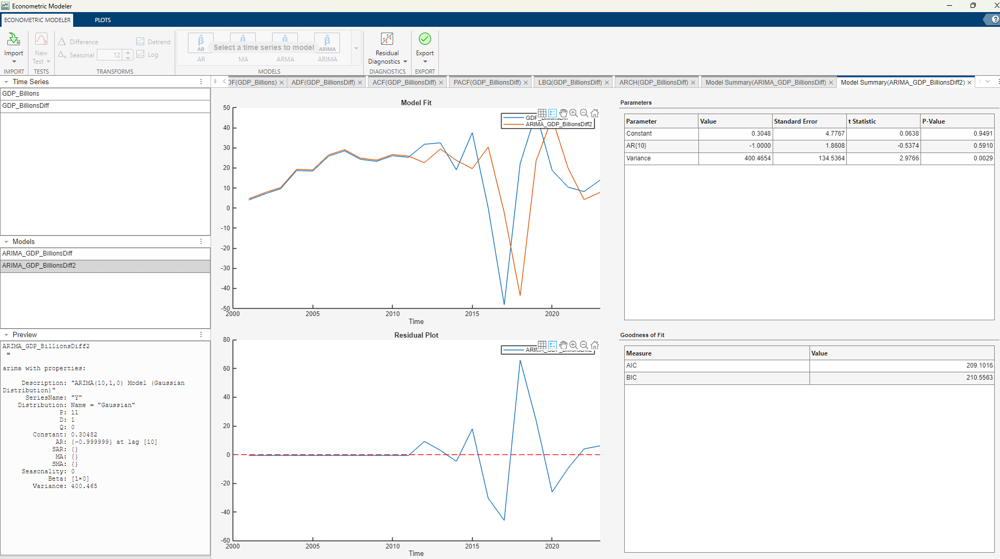


**Goodness of Fit (AIC/BIC)**

| **Metric**  | **ค่าโมเดลนี้**  | **ค่าโมเดลก่อนหน้า (ARIMA(0,1,0))**  | **สรุป**   |
| :-- | :-- | :-- | :-- |
| **AIC**  | 209.10  | 211.20  |  ลดลง (ดีขึ้น)   |
| **BIC**  | 210.57  | 213.38  |  ลดลง (ดีขึ้น)   |


SARIMA Model Parameters


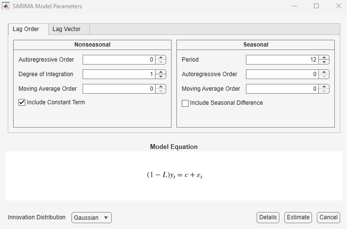

<a id="TMP_526f"></a>

# 5.Model Deployment

There are various options to deploy your model to MATLAB. We can deploy the model we created as

1.  Function and Live Function
2. Report and Documentation

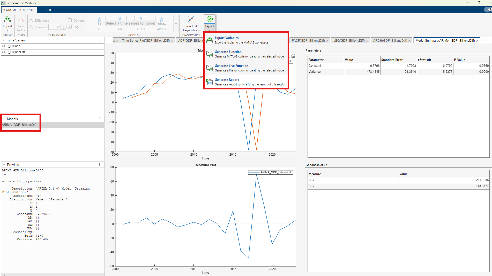


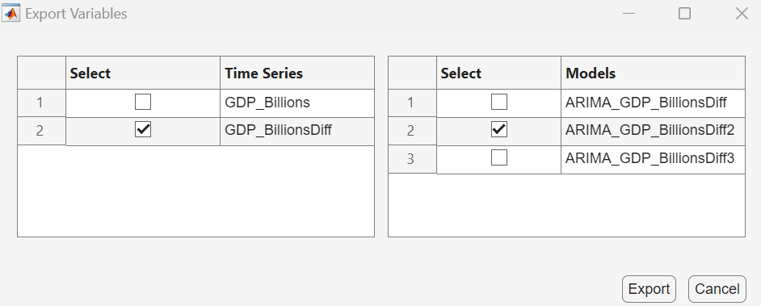

# 6.Estimate Data
```matlab
EstMdl = modelTimeSeries(TT);
% [E0, V] = infer(EstMdl, detrendedlogData);
% detrendedlogHat = detrendedlogData - E0;
```
# 7.Forecast Data
```matlab
mdlDiff   = ARIMA_GDP_BillionsDiff2;     % ARIMA model fitted on the differenced series
yDiff     = GDP_BillionsDiff(:);         % Differenced time series (as a column vector)
yLevel    = GDP_Billions(:);             % Original time series in actual (level) values
years     = Thailand_GDP_Data.Year(:);   % Year values (numeric)
steps     = 6;                           % Number of forecast periods (years ahead)

alpha     = 0.05;                        % Significance level for 95% confidence interval
z         = norminv(1-alpha/2);

% Forecast diff scale
[Yf_diff, YMSE] = forecast(mdlDiff, steps, 'Y0', yDiff);
se      = sqrt(YMSE);
CI_diff = [Yf_diff - z*se,  Yf_diff + z*se];
```
## 7.1)Convert to the original GDP level
```matlab
% convert original scale
lastLevel   = yLevel(end);
Yf_level    = lastLevel + cumsum(Yf_diff);
CI_low_lvl  = lastLevel + cumsum(CI_diff(:,1));
CI_high_lvl = lastLevel + cumsum(CI_diff(:,2));
```
## 7.2)Make dates & plots
```matlab
% Generate future years (numeric axis)
fcstYears = (years(end)+1 : years(end)+steps)';

% Simple Plot 
figure; hold on; box on;
plot(years, yLevel, 'b-', 'LineWidth', 1.8);                  % Plot actual historical data
plot(fcstYears, Yf_level, 'r*-', 'LineWidth', 1.8);           % Plot forecasted points/line์

% Plot 95% confidence interval (shaded area)
xpatch = [fcstYears; flipud(fcstYears)];
ypatch = [CI_low_lvl; flipud(CI_high_lvl)];
fill(xpatch, ypatch, [0.8 0.8 0.8], 'EdgeColor','none', 'FaceAlpha',0.25);

% Highlight the forecast period (light gray background)
yl = ylim;
patch([fcstYears(1) fcstYears(end) fcstYears(end) fcstYears(1)], ...
      [yl(1) yl(1) yl(2) yl(2)], [0.9 0.9 0.95], ...
      'FaceAlpha',0.2, 'EdgeColor','none');
uistack(findobj(gca,'Type','line'),'top');  % Bring lines to the top of the shaded area

legend('Observed','Forecast','95% CI','Forecast period','Location','eastoutside');
xlabel('Year'); ylabel('GDP (Billions)');
title('Thailand GDP Forecast');
axis tight; hold off;
```

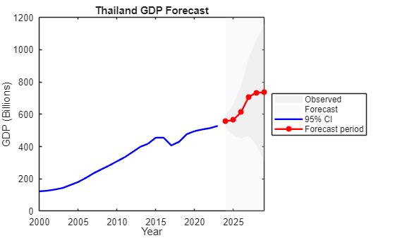
## 7.3)Write Table Save as  .xlsx
```matlab
FcstTbl = table(fcstYears, Yf_level, CI_low_lvl, CI_high_lvl, ...
   'VariableNames',{'Year','Forecast','Lower_95CI','Upper_95CI'});
disp(FcstTbl);
```

```matlabTextOutput
    Year    Forecast    Lower_95CI    Upper_95CI
    ____    ________    __________    __________

    2024     555.85       516.63        595.08  
    2025     565.31       470.62           660  
    2026     612.69       450.06        775.31  
    2027     708.56       467.49        949.63  
    2028     734.27        405.5          1063  
    2029     735.18       310.33          1160  
```

```matlab
writetable(FcstTbl,'GDP_Forecast_ARIMA.xlsx');
```
<a id="TMP_338a"></a>

# Key Takeaways
1.  Many interactive and easy to use apps that can help explore,iterate and automate workflows.
2. Flexibility and options to choose networks and optimizations based on data and requirements.
3. Offers and end\-to\-end workfow from data preparation to deployment.
